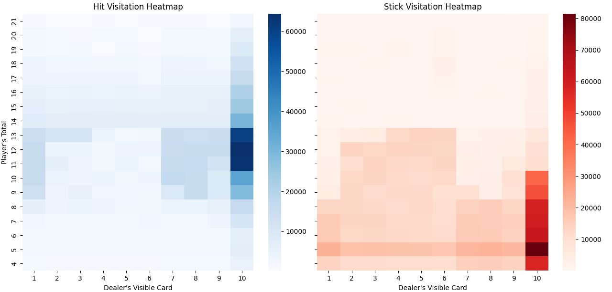

# **Blackjack AI**

A simplified Blackjack simulation with AI agents that learn to play using **Monte Carlo methods**. The coding experiment includes a regular agent and a card-counting agent, both trained to optimize their strategies against a dealer, and was created as an intro to RL and also to humiliate my broter at Black-Jack.

## **Features**
- Simplified Blackjack rules:
  - No splitting or doubling down.
  - Dealer must hit on a soft 17.
- Two AI agents:
  - **Regular Agent**: Learns using Monte Carlo sampling.
  - **Card Counting Agent**: Incorporates running count to adjust its decisions dynamically.
- Deck reshuffles automatically after every 5 games.
- Performance tracking during training with win percentage visualization.
- Early stopping during training if the agent achieves a win rate of **50% or higher**.
- Continue training on an already trained model, if you think it can do better and you got the patience.

---

## **Project Structure**

```bash
.
├── Images/
│   ├── training progress plots 
│   ├── policy plots
│   └── visitation plots
├── Trained Agents/                 # Trained model files to load.
│   ├── blackjack_agent.pkl         ## Naive agent
│   └── blackjack_counter_agent.pkl ## Card counter agent
├── blackjack.py                    # Game class with dealer handling
├── agent.py                        # AI agent
├── main.py
├── README.md
└── requirements.txt
```
---

## **How to Run**

### **1. Clone the Repository**
```bash
git clone https://github.com/shaharoded/Blackjack-AI.git
cd Blackjack-AI
```

### **2. Install Dependencies**

```bash
python -m venv venv
venv\Scripts\activate
pip install --upgrade pip
pip install -r requirements.txt
```

### **3. Run the Script**

```bash
python main.py
```

You'll be prompted with the following menu:

```bash
🃏 Blackjack AI Trainer 🃏
1. 🎓 Train Model
2. 📊 Test Model
3. ❌ Exit
```

## Performance

- **Regular Agent:** Stabilizes at approximately 41% win rate after training for 100,000 episodes. This performance is expected due to the simplified rules and inherent house edge.

- **Card Counting Agent:** Shows a slight improvement (3-4%) by exploiting running count information but remains constrained by the simplified state representation.

### **Win Percentage Plot (Sample Training Run)**

#### **Training Progress Plot - Regular Agent (200K episodes)**


```bash
Test Results: {'win': 2041, 'lose': 2545, 'draw': 414}
Win Percentage: 41.62%
```

#### **Training Progress Plot - Card Counter (300K)**
The counter is a slower learner than the regular agent, reaching plateau only later. I also noticed that given it's exploration method, and it's less-greedy method, it looks on the train set as if it's performances are lower, when in fact on purly deterministic testing enviroment it's performances are better. 

```bash
Test Results: {'win': 2177, 'lose': 2405, 'draw': 418}
Win Percentage: 43.54%
```
#### **Policy Heatmap - Card Counter**

Allows you to asses the agent's next move at a given scenario. You can see it caught on a few important base moves. Fine tuning the exploration will probably yield better strategies:


#### **Exploration Heatmap - Regular**

Allows you to asses if a relative starvation happend for certain states:




## Considerations
Agent Limitations:

 - The simplified rules (no doubling down, splitting) reduce the potential for strategy optimization.
 - Monte Carlo methods are computationally expensive and converge slowly for large state-action spaces.

## Environment Constraints:

State representation is simplified (player_value, dealer_card, usable_ace, n_cards_in_hand), which limits the agent's ability to generalize.

## **Analysis of Results**

The Blackjack AI agents demonstrate the ability to learn basic strategies within the constraints of the simplified environment. Below is a summary of the performance and areas for improvement:

### **Performance**
1. **Regular Agent:**
   - Achieved a stable win rate of approximately **41%** after training for ~100,000 episodes.
   - The plateau is consistent with expected performance given the house advantage and limited decision-making options (hit or stick only).
   - The agent's learning is evident through its ability to avoid busting more effectively over time.

2. **Card Counting Agent:**
    - Improved win rate by **3-4%** compared to the regular agent on testing cases, demonstrating the utility of the running count.
    - The benefit of card counting is constrained by:
    - Regular deck reshuffling after every 5 games.
    - Simplified state representation, adding only deck's running count, which limits the agent’s ability to fully exploit the running count.

### **Key Observations**
- **Simplified State Representation:** The current state includes only `player_value`, `dealer_card`, `usable_ace`, `len(player_hand)` and `running_count` (for CardCounterAgent only). This limits the agent's ability to generalize nuanced strategies.
- **House Advantage:** The dealer acts after the player, ties go to the dealer, and no doubling down or splitting is allowed. These rules inherently favor the dealer, keeping the player’s win rate below 50%.
- **Monte Carlo Sampling Efficiency:** The agent relies on visiting states frequently to learn, which may slow down convergence for rare scenarios.

---

## **How to Improve**

### **1. Use a More Sophisticated Learning Algorithm**
- Use **Value Iteration** instead of **Policy Iteration**. Under the assumption you can approximate the transition probabilities properly, this method is more optimal for spaces with larger states dimantions than action dimentions and can converge much faster.
- Implement **Deep Q-Networks (DQN)**:
  - Allows for faster convergence and better generalization.
  - Enables the agent to handle more complex state-action spaces, such as multiple decks or additional decision options.
  - Using DNN based solutions could significantly enhance the training time and probably performance, allowing for difficult states to be better learnt.

### **2. Enhance State Representation**
- Incorporate more details into the state, such as:
  - **Hand Composition:** Include specific card combinations to account for soft/hard totals.
  - **Remaining Deck Composition:** Track cards dealt to estimate probabilities of specific draws.

### **3. Extend Blackjack Rules**
- Add support for **doubling down**, **splitting**, and **insurance**. These options provide strategic opportunities to increase the player's advantage.
- Introduce **betting strategies**, allowing the agent to optimize based on the running count.

### **4. Reduce Deck Reshuffling Frequency**
- Increase the number of games before deck reshuffling or introduce multi-deck play (e.g., 4-deck or 8-deck shoes). This would amplify the benefits of card counting.

### **5. Train for Longer Periods**
- Run training for **200K+ episodes** to explore more states and refine the agent’s policy further.

### **6. Optimize Hyperparameters**
- Experiment with:
  - **Exploration Rate (Epsilon):** Test decay schedules to balance exploration and exploitation.
  - **Learning Rate (Alpha):** Adjust the rate at which the Q-values are updated.

---

By implementing these improvements, the Blackjack AI can evolve from a basic rule-following agent to a more advanced and competitive player capable of exploiting strategic opportunities.

## Git Updates

```bash
git add .
git commit -m "commit message"
git branch -M main
git push -f origin main
```